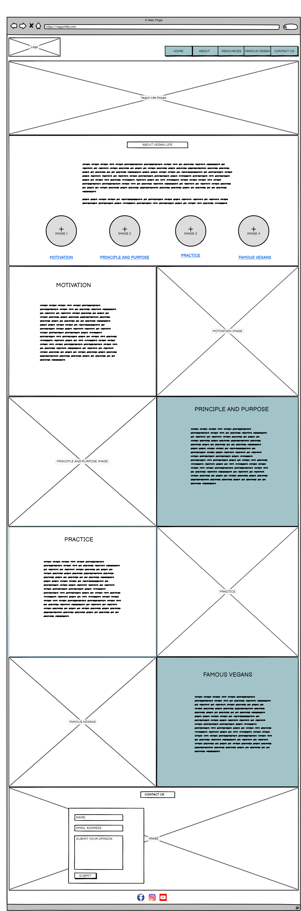
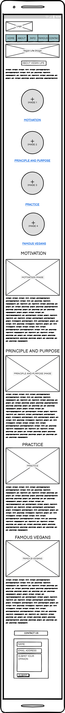
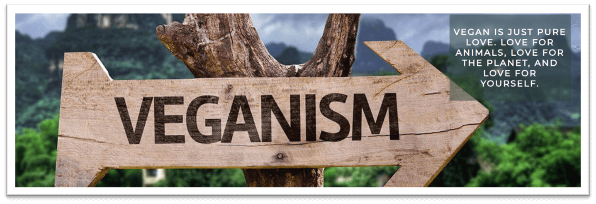
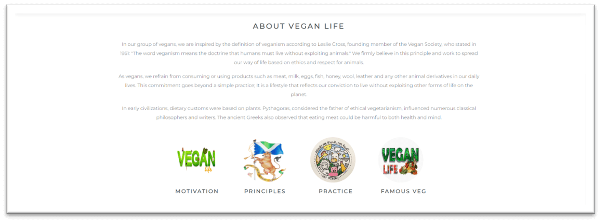
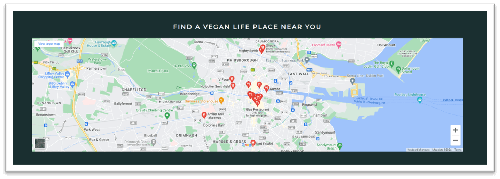
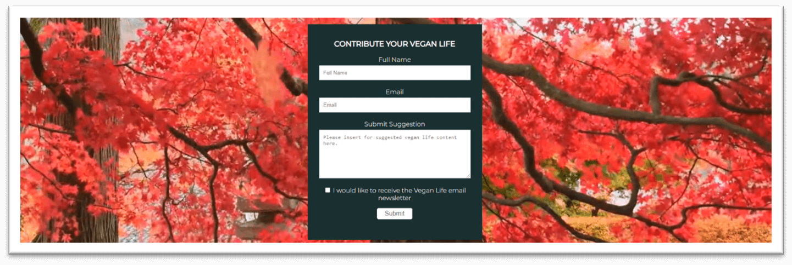

# Vegan life

Vegan Life is a website that aims to inform users about vegan life style. The site is intended for users who wish to change their life in order to start a vegan life. 

Vegan Life includes step by step info about the vegan stylelife with images and a description of the benefits of this new life style. Users who wish to attend a meeting  can use the Google Maps section to find where there is a meeting in the neighborhood. The site is intended for users who wish to have information about the vegan life in order to change their life style.

The live link can be found here [Vegan life]

[Image if Vegan life is responsive]

## Site Owner Goals 
- To provide the user with information about the benefits of vegan lifestyle, with a particular focus on philosophy of veganism. 
- To provide the user with clear and instructions as to how to complete the transition to a vegan lifestyle.
- To present the user with a website that is easy to navigate, fully responsive and invokes a sense of calm and and non-violence through the use of appropriate colours and images. 
- To enable the user to find places where the vegan community gathers for meetings and conferences.
- To allow users to contribute their opinions and sign up to the vegan life newsletter.

## User Stories
- ### First time user
  - As a first time user I want to understand the main purpose of the site and learn about the wellbeing of a vegan lifestyle and the health and mental health benefits.
  - As a first time user I want to be able to intuitively navigate the website and have a positive emotional experience. 
  - As a first time user I want to be able to browse vegan life content without having to sign-up / register.

- ### Returning User
  - As a returning user I want to easily navigate to the information of vegan life site.  
  - As a returning user I want to find step by step info in order to complete the transition to a vegan lifestyle .
  - As a returning user I want to be able to find vegan community in my locality to be part of the vegan community in my neighborhood.

- ### Frequent User
  - As a frequent user I want to be able to sign-up to the vegan life newsletter in order to get the latest news and information about the vegan lifestyle.
  - As a frequent user I want to be able to contribute with my opinion regarding the topics discussed in the page.

## Design

### Imagery
The imagery used on the vegan life site is very important to the overall experience of the user. A calm theme is consistently used across all imagery with lots of green and peacefull scenes. This gives the sense of union with nature and animals which has great benefits for health, mental health and is intended to invoke a sense of calm and non-violence in the user. The colour green and nature and anumals theme is also important as this ties into the main colour scheme of the website.

### Colours
The colour scheme of the website is white and green with varying shades of green orange used to tie in with the vegan imagery. A dark grey font is used which has a good contrast with the light green and white backgrounds making it easy to read. 

### Fonts
The Montserrat font is the main font used throughout the whole website. This font was imported via [Google Fonts](https://fonts.google.com/). I am using Sans Serif as a backup font, in case for any reason the main font is not being imported into the site correctly.

## Wireframes
Wireframes were produced using Balsamiq. 

 
Desktop Wireframe

 

 

    
Mobile Wireframe

 

## Features
- ### Navigation

    - The fully responsive navigation bar includes links to the Logo, Home, About, Info, Find Us, Contact Us.
    - The Info navigation link includes a drop down menu which includes further links to each section.
    - The navigation bar has a fixed position so that it remains visible at the top of the page as the user navigates through the individual sections. 
    - A drop shadow was applied to the navigation bar to make sure that it doesn't blend into the other sections of the page upon scrolling.
    - This section allows the user to easily navigate through the site to find content without having to scroll back up to the top of the page or use the browser back button.

- ### The Landing Page Image
    - The landing page includes an eye-catching image with a text overlay describing the site's goal.
    - This section provides the user with a clear visual representation of the purpose of the site.

 

- ### About Section
    - The About Section gives a brief description of vegan life gives further details about what the site offers to users.
    - Below the About text there are four small images with navigation links to each Info Section.
    - This section will show users the value of vegan life and links invite the user to further explore the site as an alternative to the navigation bar. 

- ### Info Section
    - This section contains four section linked to a different section and type of info. 
    - This section is valuable as the user is provided with step by step instructions and the benefict of a vegan lifestyle. 

  

- ### Find Us Section
    - The Practice Section includes an iframe with an embedded Google Map showing the locations of vegan place in Cardiff.
    - This section will enable the user to find a vegan place within their locality should they wish to attend a restaurant or the vegan community.

- ### Contact us Section
    - The contribute section includes a background video of a tree with moving leaf.
    - The user is invited to sign up to Vegan Life and contribute their suggestion. The users have the possibility to receive the Vegan life Newsletter by selecting the checkbox provided.

 

- ### Footer
    - The footer section includes links to Vegan's life Facebook, Instagram, Twitter and Youtube pages.
    - The links will open to a new tab to allow easy navigation for the user. 
    - The footer is valuable to the user as it allows them to find and follow Vegan Life on social media

### Features Left to Implement
- A button for the mobile nav bar.
- The ability to search by Info as the bank of information, books, studies grows.

## Testing

### Validator Testing
- #### HTML
    - No errors were returned when passing through the official W3C Markup Validator
        - [W3C Validator Results](https://validator.w3.org/nu/?doc=https%3A%2F%2Fchristiancricchi.github.io%2FVegan-Life%2Findex.html))
- #### CSS
    - No errors were found when passing through the official W3C CSS Validator 
        - [W3C CSS Validator Results](https://jigsaw.w3.org/css-validator/validator?uri=https%3A%2F%2Fchristiancricchi.github.io%2FVegan-Life%2Fassets%2Fcss%2Fstyle.css&profile=css3svg&usermedium=all&warning=1&vextwarning=&lang=en)
- #### Accessibility 
    - The site achieved a Lighthouse accessibility score of 100% which confirms that the colours and fonts chosen are easy to read and accessible

